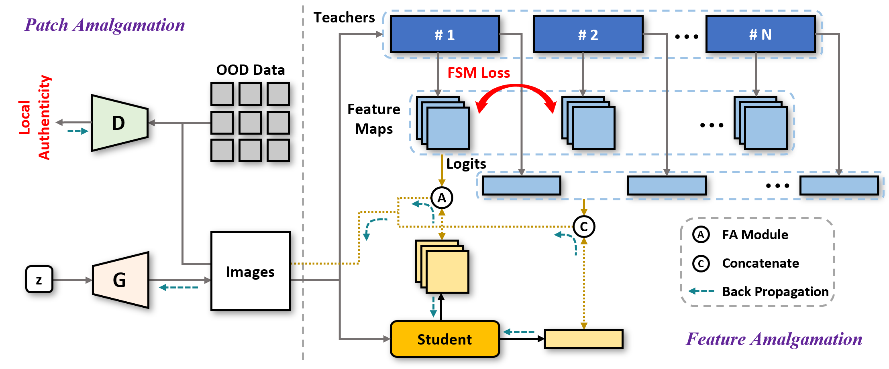
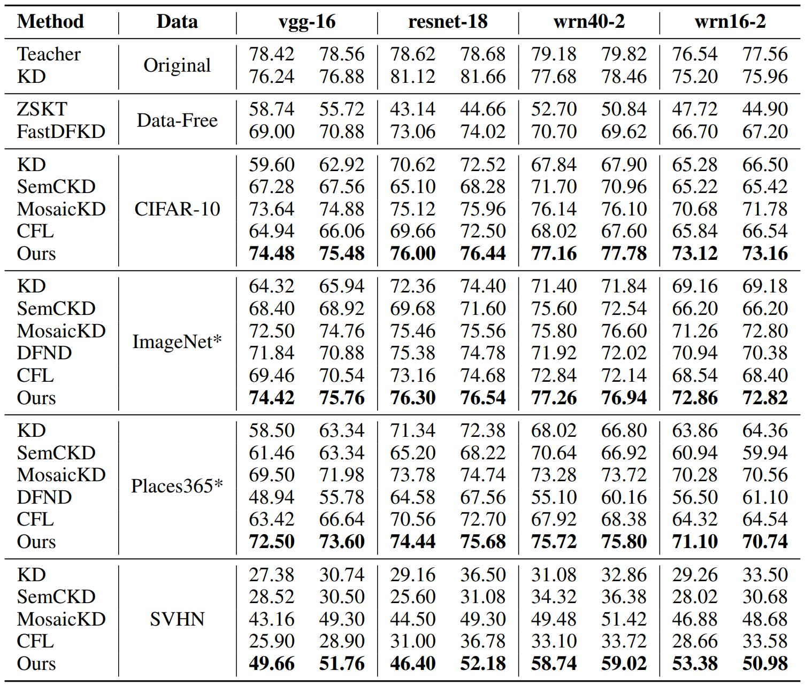

# OOD-KA
Code for paper "OOD-KA: Amalgamating Knowledge in the Wild"


<div align="center">
</img> 
</div>


## Reproduce our results
```bash
cd engine/datasets
python split_cifar100.py
```


<div align="center">
</img> 
</div>